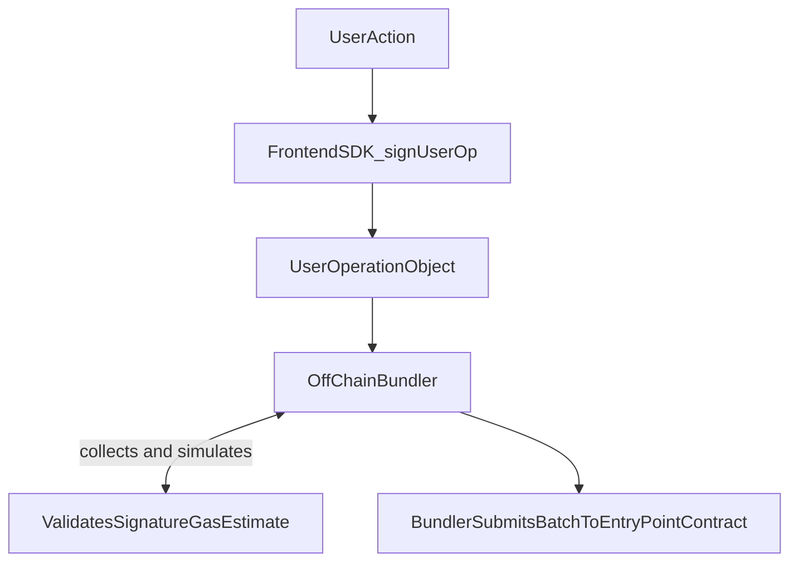
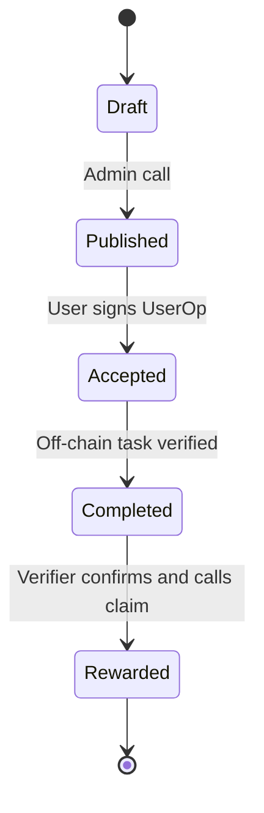
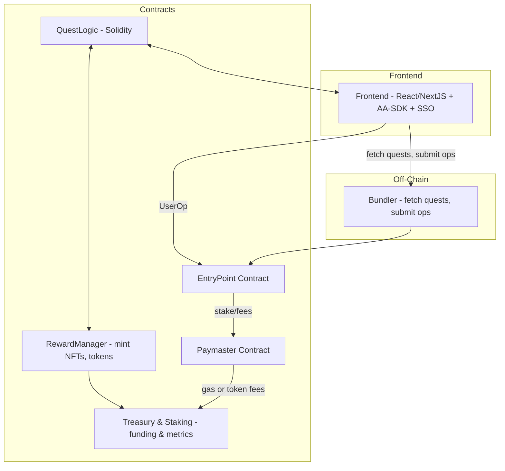

# NERO Quest: SocialFi Bounty Board with Paymaster UX

## 🖋️ Executive Summary

**NERO Quest** is a decentralized SocialFi and GameFi bounty platform designed to drive on-chain engagement and mass adoption of NERO Chain. By leveraging NERO’s Account Abstraction (AA) and Paymaster features, NERO Quest offers a gasless, Web2-like onboarding experience where users discover and complete community-driven tasks—"quests"—to earn token rewards and Soulbound NFTs. This ideation document outlines the problem space, solution overview, detailed AA/Paymaster integration, system architecture, user flows, MVP roadmap, success metrics, risks, and next steps including UI prototyping via V0.dev.

----------

## 🎯 Problem Statement

1.  **Gas Friction:** New users abandon dApps when faced with complex wallet setups and unpredictable gas fees.
    
2.  **Low Engagement:** Existing bounty platforms lack gamification and seamless social integration.
    
3.  **Onboarding Gap:** Web3 lacks familiar sign-in methods (social/email) that Web2 users expect.
    

----------

## 💡 Solution Overview

-   **Gasless Onboarding & Transactions:** Abstract gas complexity using AA wallets and Paymaster sponsorship.
    
-   **SocialFi + GameFi Fusion:** Gamify community tasks (retweets, feedback, staking) into quests redeemable for NFTs and tokens.
    
-   **Web2 Familiarity:** Support email/SSO logins while retaining full on-chain ownership and composability.
    

----------

## 📈 Value Proposition

| **User Benefit**                 | **dApp Benefit**                          |
|----------------------------------|-------------------------------------------|
| No gas fees or wallet setup      | Higher user acquisition & retention       |
| Gamified quests & levels         | Increased ecosystem activity              |
| Tangible NFT rewards             | Cross-project network effects             |

----------

## 🛠️ Detailed AA & Paymaster Integration

### 1. AA Wallet Provisioning

-   **Smart-Contract Wallets:** Deployed per user via AA-platform dashboard.
    
-   **SocialLogin Module:** OAuth2 flows (Google, Twitter) trigger wallet creation; keys managed in browser session.
    

### 2. UserOperation Lifecycle

###  3. Quest Lifecycle

### 4. Paymaster Configuration

-   **Dashboard Setup:** Define sponsored methods (`acceptQuest`, `claimReward`) and approved tokens for gas payment.
    
-   **Gas Sponsorship Logic:** On calling `EntryPoint.handleOps()`, the Paymaster contract verifies sponsored method, locks required stake, and transfers fees.
    

### 5. Token-Based Gas

-   **Alternative Gas Payment:** Users optionally pay fees in partner ERC-20 tokens (e.g., stablecoins), processed via Paymaster’s `postOp` deduction logic.
    

----------

## 🔌 System Architecture Diagram

---

## 🧩 User Flow

1.  **Onboard**
    
    -   Click **"Sign up with Google"** → OAuth2 → AA-platform spins up a smart-contract wallet.
        
    -   Wallet address linked to user profile (off-chain).
        
2.  **Discover Quests**
    
    -   Frontend calls `QuestLogic.getActiveQuests()` → list displayed with descriptions, rewards, and progress bars.
        
3.  **Accept Quest**
    
    -   User clicks **"Accept"** → `sdk.signUserOp({ target: QuestLogic.address, data: acceptQuest(questId) })`.
        
    -   Bundler simulates & submits; Paymaster covers gas.
        
4.  **Complete Off-Chain Action**
    
    -   Social action (e.g., retweet) tracked by our verifier service.
        
    -   Verifier calls `QuestLogic.verifyAndReward(user, questId)`, triggers on-chain logic.
        
5.  **Claim Reward**
    
    -   RewardManager mints Soulbound NFT + transfers token reward.
        
    -   All txs gas-sponsored or paid via approved ERC-20.
        

----------

## 🚀 MVP Roadmap & Timeline

| **Phase** | **Milestone**                                      | **ETA**         |
|----------:|----------------------------------------------------|-----------------|
| 1         | Core AA-wallet + SSO integration                   | Wave 2    |
| 2         | QuestLogic contract (accept, verify, reward)       | Wave 3    |
| 3         | Paymaster setup & gasless transactions             | Wave 4    |
| 4         | Off-chain verifier & basic UI                      | Wave 5|
| 5         | UX polish, mobile responsiveness, analytics        | Wave 6   |

----------

## 📊 Success Metrics

-   **Onboarding Conversion:** % of visitors completing AA-wallet setup (> 70%).
    
-   **Quest Completion Rate:** % of accepted quests completed (> 60%).
    
-   **DAU/WAU Ratio:** > 30%.
    
-   **Average Rewards Claimed:** ~$5/user/week.
    

----------

## ⚠️ Risks & Mitigations

| **Risk**                                | **Mitigation**                                          |
|-----------------------------------------|---------------------------------------------------------|
| AA-wallet deployment failures           | Fallback to basic EOA wallet flow                       |
| Bundler downtime                        | Multi-instance bundler with health checks              |
| Excessive Paymaster gas expenditure     | Dynamic gas caps & token-based gas                     |

---

